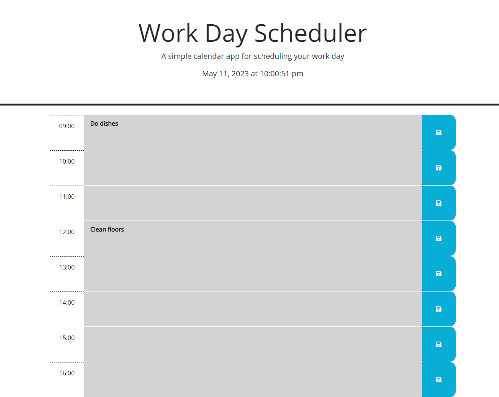

# zaingova-work-day-scheduler

## Description

This is a simple calendar app. Time blocks in the past are gray, the blocks in the current hour are red, and the blocks in the future are green.

## Visuals

## Github Pages Deployed Link

[https://zaingova.github.io/zaingova-work-day-scheduler/](https://zaingova.github.io/zaingova-work-day-scheduler/)

## Usage

click on any time block and type in the event you want to save. Then, to the right side of the page there's a blue save button. It saves your event to the local storage so when you reload the page your event will still be there.

## Licence

Standard MIT Licence